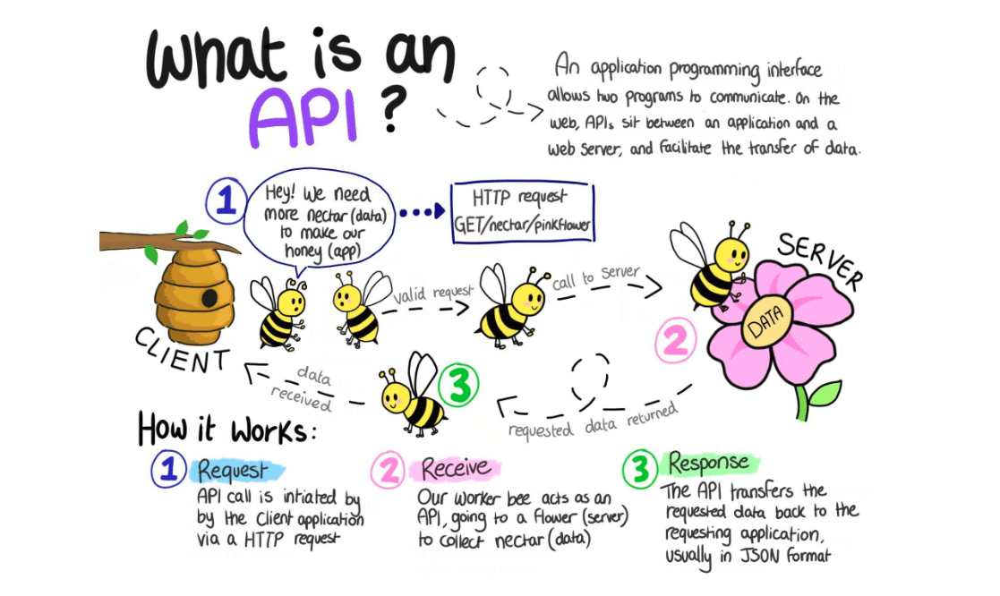
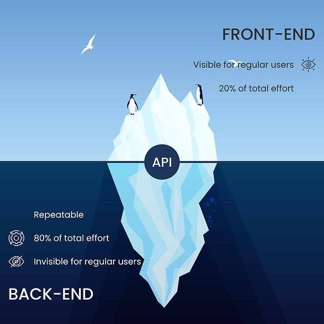
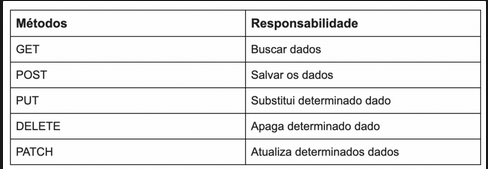

# Conceitos

* Documentação:&#x20;



* > Conceito REST (**RE**presentational **S**tate **T**ransfer)
* > Uma API é uma interface de comunicação de aplicações.

Criamos essas interfaces utilizando um padrão de design RESTful

* REST != RESTful
* HTTP ("sem estado")

O cliente é quem vai lembrar o que precisa pedir para o servidor

Para pedir os dados, o cliente precisa acessar endpoints (caminho para acessar o servidor, uma rota)

* > O servidor não sabe quem é o cliente, é como se toda vez que fosse fazer a requisição, se apresentasse novamente.

Endpoints: são nomeados com subsantivos (recursos), podem representar coleções de registros ou registros individuais.

Resources (Recursos): Um model por exemplos(usuário, produtos, categorias)

Criamos CRUD nesses resources.

Endpoints com verbos

Ação -> em RESTful usa verbos HTTP para dizer o que faremos:

<figure><figcaption></figcaption></figure>

### Requests

* → Tudo o que está após o símbolo de interrogação (? - question mark) são conjuntos de pares

Chave/valor que podem ser usadas pela API para alterar os dados de acordo com esses parâmetros.

Essa maneira de passar dados em uma requisição é chamada "query string".

<figure><figcaption></figcaption></figure>

<figure><figcaption></figcaption></figure>

<figure><figcaption></figcaption></figure>

### Responses

<figure><figcaption></figcaption></figure>

Assim como uma Request, a Response (resposta) também possui cabeçalho, exemplo:

<figure><figcaption></figcaption></figure>

#### HTTP STATUS CODE/FORMATO DE DADOS



<figure><figcaption></figcaption></figure>

<figure><figcaption></figcaption></figure>



<mark style="background-color:blue;">XML:</mark>

O XML é uma linguagem de marcação, ou seja, um conjunto de regras utilizado para formatar documentos de maneira que os dados possam ser lidos e interpretados por diferentes sistemas.

O XML é um arquivo de texto simples, podendo ser criado em qualquer editor de textos comum ou programaticamente via softwares. O documento XML é estruturado por tags, que identificam os elementos e os conteúdos do documento. Abaixo, um exemplo de um arquivo com dados de um jogo de videogame.

<figure><figcaption></figcaption></figure>

<mark style="background-color:blue;">JSON:</mark>

O formato JSON (JavaScript Object Notation) é, como o nome sugere, uma forma de notação de objetos JavaScript, de modo que eles possam ser representados de uma forma comum a diversas linguagens.

Além disso, uma ideia que está fortemente enraizada neste formato é que ele seja facilmente trafegado entre aplicações em quaisquer protocolos, inclusive o HTTP. Portanto, a principal diferença entre um objeto JavaScript padrão e um JSON é o fato do JSON ser na realidade: um texto.

<figure><figcaption></figcaption></figure>

#### Segurança de APIs - Cache

{% embed url="https://thiagolima.blog.br/parte-7-cache-compress%C3%A3o-e-muito-mais-sobre-performance-em-apis-restful-70d458d3879c" %}

Cache é uma estrutura computacional de armazenamento focada em manter cópias de dados que são acessados com frequência.

O propósito do cache é acelerar a busca de dados que são muito utilizados e poupar a utilização de recursos de um servidor.

Com o cache, você tem os seguintes benefícios na sua API:

* Redução da latência de rede
* Redução de carga de processamento dos servidores
* Otimização de tempo de resposta ao client

Os caches são divididos em duas grandes categorias:

Shared cache — Armazena respostas de servidores para reutilização entre diversos usuários.

Private cache — Armazena respostas de servidores para utilização de um usuário único.

Esses caches podem ser implementados através do browser, servidor proxy, gateway, CDN, proxy reverso, ou load balancer de servidores WEB.

Segurança de APIs – Quantidade de Requisições

Uma analogia simples para contextualizar esse fundamento da arquitetura de API é comparar a API a uma cidade moderna. A cidade tem alguns recursos (lojas de serviços), e esses recursos são conectados uns com os outros através das ruas. As ruas possuem limitações físicas (na quantidade de faixas aonde cabem os carros) e também limitações de segurança (como as placas de velocidades, radares, semáforos, lombadas).

Da mesma forma, os recursos oferecidos pelas APIs precisam oferecer as mesmas limitações. Ao desenvolver uma API, o desenvolvedor precisa considerar as limitações físicas do sistema, que são a largura de banda da internet, o número de conexões simultâneas que podem ser roteadas e que o servidor suporta além da quantidade de dados que podem ser transferidos entre o sistema e os usuários. Prevenir que o limite de segurança seja ultrapassado irá prevenir acidentes, assim como nas ruas!

* Segurança de APIs

Autenticação - quem é você

Autorização - o que pode acessar

Você pode ter autenticação para ver um site por exemplo, mas não modificá-lo

Token – como um "código" que recebe quando acessa o servidor pela primeira vez.

<figure><figcaption></figcaption></figure>

Programação Assíncrona && Síncrona

Assíncrona != Paralela && Síncrona

A Programação assíncrona é uma forma de evitar delays ou tempos de espera na execução de um programa. Quando estamos executando algo sincronicamente, podemos ter bloqueios no processo pela necessidade de esperar alguma execução de código. Isso pode  bloquear o programa como um todo até que termine a execução deste passo.

Na prática

O SO gerencia a thread do sistema sendo uma única thread que executa passo a passo de forma procedural, ou seja de maneira **síncrona**.

Quando trabalhamos com formato **assíncrono,** podemos ter várias execuções de processos (threads) sem bloquearmos a thread principal ou as demais se assim desejarmos. Dessa forma, podemos trabalhar de forma paralelizada.

Observe uma chamada síncrona:

<figure><figcaption></figcaption></figure>

Chamada Assíncrona:

<figure><figcaption></figcaption></figure>

* links:





Criando o Projeto:

<figure><figcaption></figcaption></figure>

* <mark style="background-color:purple;">Para criar a venv: python –m venv nome</mark>
* <mark style="background-color:purple;">Não esquecer de ativar: venv\Scripts\activate</mark>
* <mark style="background-color:purple;">Desativar depois: deactivate</mark>



<figure><figcaption></figcaption></figure>

• Decorator: executar outra função junto com a função que já tem
